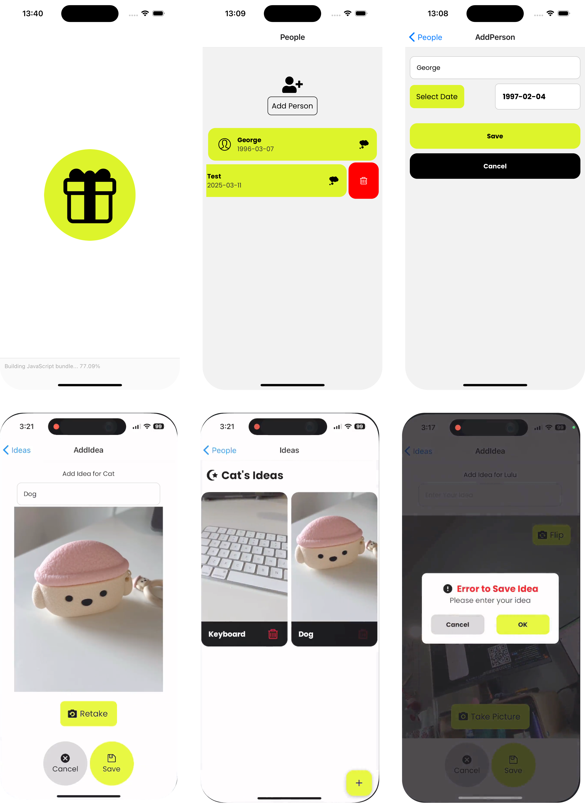

# Gift Ideas

## Overview
Gift Ideas is a mobile application built using React Native and Expo that helps users keep track of gift ideas for their loved ones. The app allows users to add people, record their birthdays, and save gift ideas with descriptions and photos. Never forget a great gift idea again!



## Features
+ Add and manage people with their names and birthdays
+ Record gift ideas for each person
+ Capture photos of potential gifts using device camera
+ Easy navigation between people and their gift ideas
+ Delete people and ideas when no longer needed
+ Persistent storage of data across app sessions
+ User-friendly interface with modern design elements

## Tech Stack
+ React Native: Cross-platform mobile framework
+ Expo: Development platform and tools
+ React Navigation: Screen navigation
+ AsyncStorage: Local data persistence
+ Expo Camera: Photo capture functionality
+ React Native Paper: UI components
+ React Native Modern Datepicker: Date selection interface
+ Expo Google Fonts: Custom typography with Poppins font family
+ React Native Gesture Handler: Swipe actions and gestures

## Start the development server:
```sh
npx expo start
```

## Usage
+ Home Screen: View list of people you've added
+ Add Person: Click the "Add Person" button to add someone new with their name and birthday
+ Gift Ideas: Tap on a person to view or add gift ideas for them
+ Add Idea: From a person's page, add a new gift idea with description and photo
+ Delete: Swipe left on a person or idea to delete it

## Project Structure
```
gift-ideas/
├── assets/              # App assets including images and fonts
│   ├── adaptive-icon.png
│   ├── favicon.png
│   ├── icon.png
│   ├── splash.png
│   └── screenshots/     # App screenshots for documentation
├── context/            # Context providers for state management
├── components/          # Reusable UI components
│   └── messageModal.js  # Modal dialog for confirmations and errors
├── screens/             # Main application screens
│   ├── PeopleScreen.js  # Home screen to display and manage people
│   ├── AddPersonScreen.js # Screen to add a new person with birthday
│   ├── IdeaScreen.js    # Screen to view and manage gift ideas for a person
│   └── AddIdeaScreen.js # Screen to add a new gift idea with camera
├── App.js              # Application entry point
├── app.json            # Expo configuration
└── package.json        # Project dependencies
```

## Screens
- **PeopleScreen**: Main screen that displays a list of people with their names and birthdays sorted by date. Users can add new people or select a person to see their gift ideas. Includes swipe-to-delete functionality.
- **AddPersonScreen**: Form screen for adding a new person with name and birthday. Features a custom animated date picker that slides up from the bottom.
- **IdeaScreen**: Displays all gift ideas for a selected person in a grid layout. Each idea shows an image and description. Users can view images in full-screen mode or delete ideas.
- **AddIdeaScreen**: Camera interface for capturing gift idea photos with description input. Users can switch between front and back cameras and save the idea to a person.

## Components
- **MessageModal**: A reusable modal dialog component for displaying warnings, confirmation messages, and error alerts throughout the app. Supports customizable titles, messages, and action buttons.


## Author
[Lulu Zhang](https://profile.catlulu.net/)


Built with ❤️ using React Native and Expo